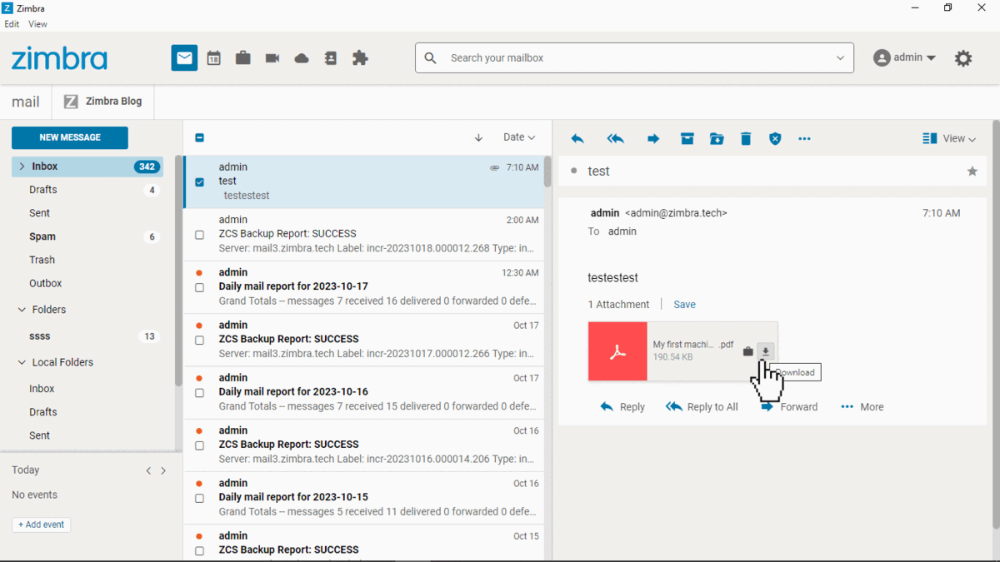
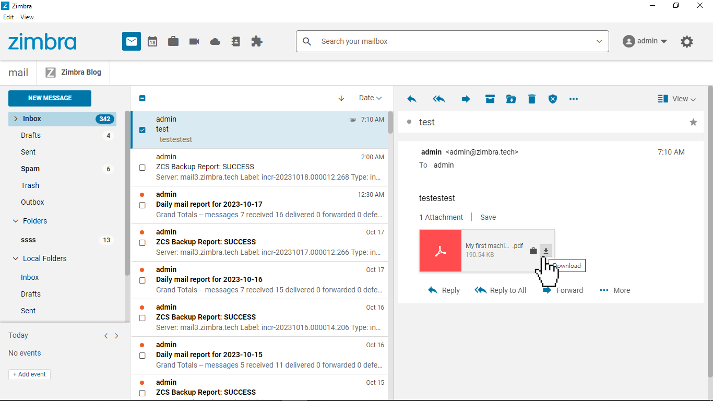
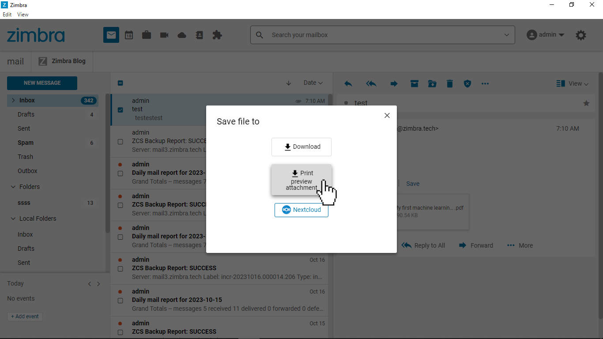
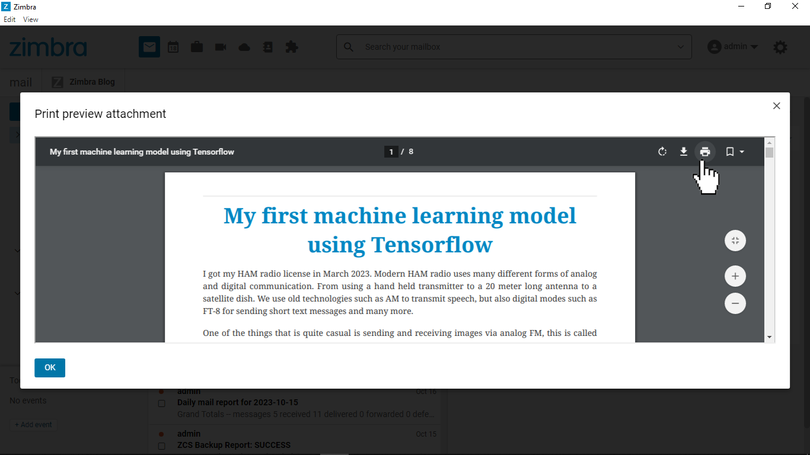
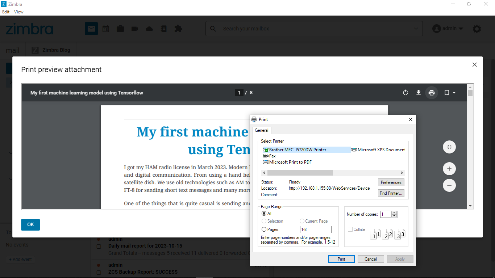

# Print preview an attachment

This Zimlet adds a link to print preview an attachment without having to download and save the attachment, reducing number of user interactions.

This Zimlet was made for users of Zimbra Desktop that need to print many PDF attachments during their daily workflow. Out-of-the box on Zimbra Desktop this requires one to store the PDF locally first, then open Windows Explorer to navigate to it. Additionally sometimes the locally saved PDF will not have the file extension, meaning users have a hard time opening the file after saving it.

This Zimlet eliminated to need to save the PDF attachment locally, and offers a print button from the UI.

## Screenshots

